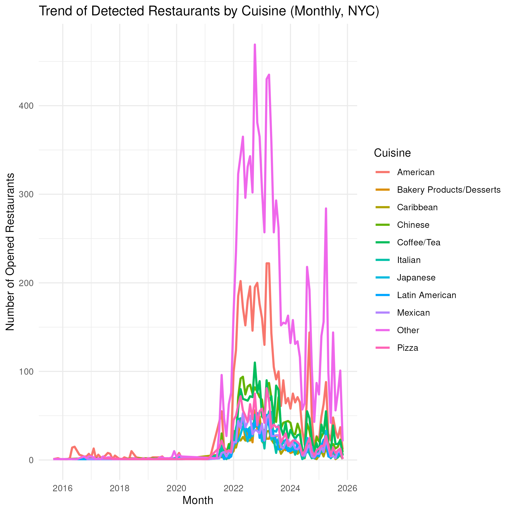
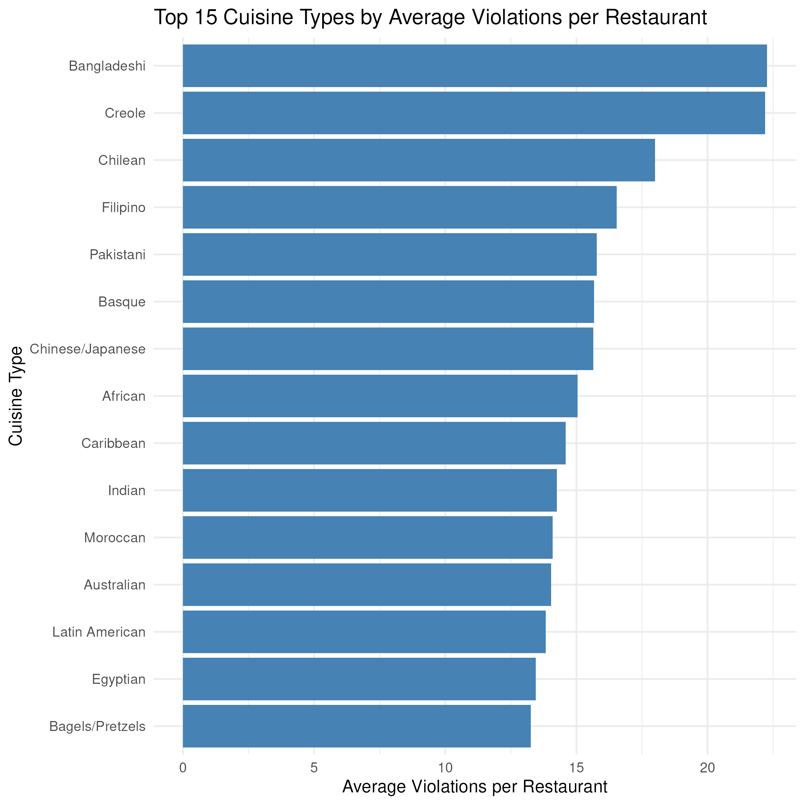
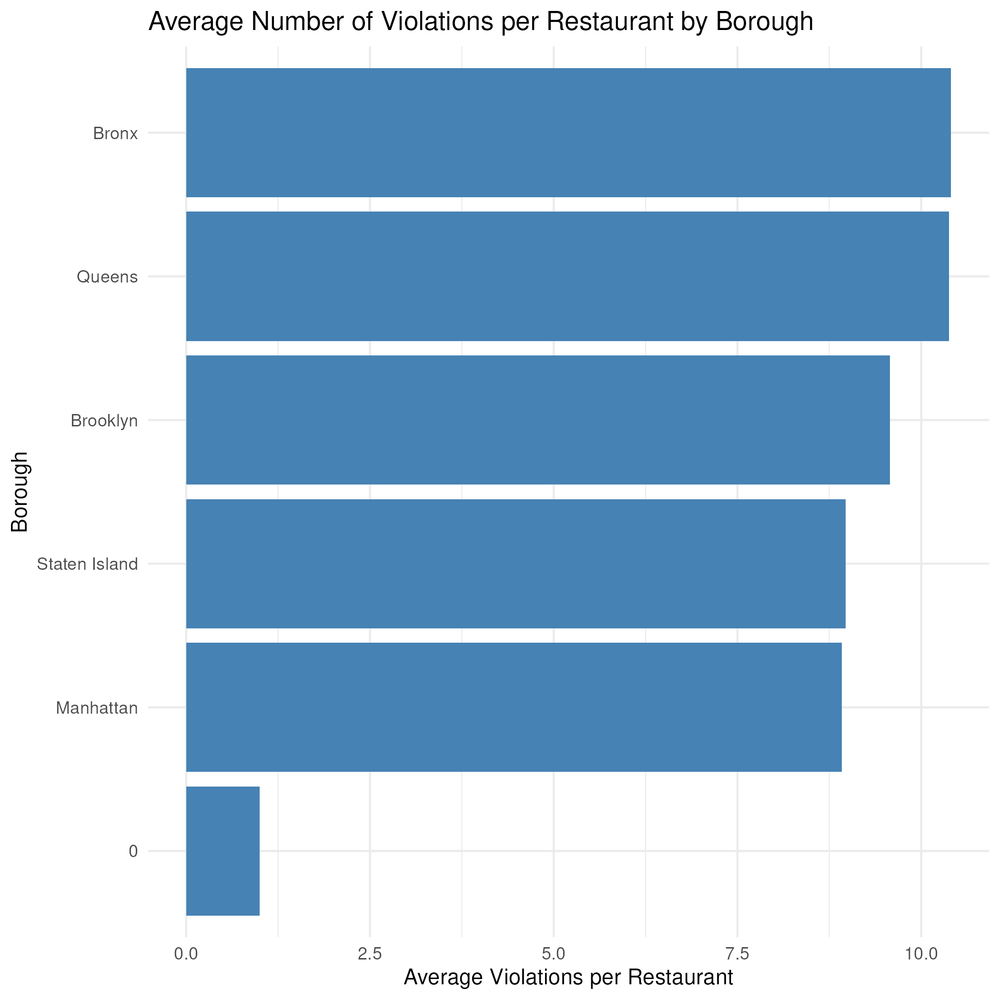

This report is aimed to investigate the Restaurant in NYC regarding its restaurant type and inspection date. 'DOHMH_New_York_City_Restaurant_Inspection_Results.csv' is a frequently updated csv file that was created by the government. There are 292k columns with 27 variables. Among those colums, we can see variables such as CAMIS(The represented ID), DBA(Name of the restaurant), Cuisine Description and etc. In this report, we split up the investigation into two parts, which are factual problem and predictive problem. In the following sections, we are going to use the knowledge we learnt at BIOS611 to solve the interesting problems.


Firstly, we investigate trend of the type of opened restaurants at the time scale of month. Since the raw dataset is organized by the inspections, in order to avoid duplicates of resturant types. we kept only the earliest inspection record for each restaurants and treat it as the first time the restaurants is observed in the data, called "proxy". Then we count, at the monthly level, how many restaurants are first detected in each month in order to obtain the time trend of detected restaurants' types.  

From the coding scenario, we applied "ggplot2" and "dplyr" package to achieve our goal. "cleaned" dataset is used to filter the non-missing cuisine description and transform the variable called "inspection-date" to the time format; "open_df" dataset computes each restaurant's earliest inspection date as its opening months and keep only the those opened after January 2000; "trend_df" dataset summarise the count by grouping the proxy of month and cuisine; "top_10" dataset summarise the total and only chose the top 10 restaurants.; “trend_2df" dataset used slice function and "%in" to keep monthly count for the top 10 cuisines and collapses all other cuisine into an "other" category for the simplification; Finally we applied the ggplot tool to draw a plot that x-axis contains "month" and y-axis contains "count" with the color of cuisine
```{r setup, include=FALSE}
knitr::opts_chunk$set(echo = TRUE)
```



The result of figure reflects a surge in detected restaurant. It is likely because that of the inspection policy or post-covid recovery. From the plot, we can see that "other" type cuisine dominates the trend of the restaurant. This seems reasonable because even though the top 10 cuisines represent the most frequently opened individual types, the "Other" category aggregates all remaining cuisines outside of top 10. Beside the "other" type of cuisine, American, Chinese, Pizza, and Mexican are the most prominent among the top 10. After peaking in 2022-2023, the trends stablized at a lower at a low level in 2024-2025.  
  
Secondly, we investigate which types of restaurants and which boroughs tend to have more violations on average. We still will use the original restaurants dataset, similar with the data cleaning above, we first restrict specific cuisine type by delting missing cuisine type so that violations can be meaningfully attributed to specific cuisine types. 

For the cuisine analysis, the "cuisine_viol" dataset is constructed by grouping the data by CUISINE_DESCRIPTION and summarizing three key quantities: the total number of violation records(n_viol, computed with n()), the number of distinct restaurants within each cuisine(n_restaurants, via n_distinct(CAMIS)), and the average number of violations per restaurant(avg_viol_per_rest = n_viol / n_restaurants), We then sort cuisines in descending order of this average and keep only the top 15 by using slice function. Finally, we used the ggplot tool to create the bar plot. By reordering cuisine types by their average and using coord_flip() so that the coordinate flips and the variables won't overlap together, we get the plot we want.  

A similar procedure is applied at the boro level. The "boro_viol" dataset groups the data by BORO and computes the total number of violation records, the number of distinct restaurants, and the corresponding average violations per restaurant. We finally visualized using horizontal bar char by using the ggplot tool, again ordering boroughs by their average violations.  

```{r}

```

For the first plot, which shows the Top 15 Cuisine Types by Average Violations per Restaurant, we find that there exists a substantial heterogeneity across cuisine categories. Bangladeshi and Creole restaurants exits the highest average number of violations per restaurant. Following that, there are Chilean, Filipino, and Pakistani cuisines. Several other ethinic cuisines, including Basque, Chinese, Japanese, African, Caribbean, and Indian, also show relatively many violation averages. This   

```{r}

```

The second plot presents the Average Number of Violations per Restaurant by BORO. we find that Bronx and Queens have the highest average violations per restaurant, which both close to approximately 10 violations. Following by Brox and Queens, Brooklyn is the third and then there are Staten Island and Manhattan. This geographic variation indicates that restaurant compliance or enforcement intensity may differ across boro due to differences in density, inspection frequency and local operating conditions.  

Thirdly, we step from the factual analysis to predictive analysis. In order to easily predict cuisine description, we want to use language model to achieve that. However, firstly, we have to transform restaurant names into numerical feature representations using sentence embeddings.  

For the data cleaning, we begin with the raw NYC restaurant inspection dataset loaded from "DOHMH_New_York_City_Restaurant_Inspection_Results.csv". The variable for restaurant identification called "CAMIS" first converted to string. Then we turned to the restaurant business names called "DBA", we converted this value to lowercase and stripped of whitespace in order to standardize the text. We also make sure that records with missing vlues, empty strings, or names without any alphabetical or numeric is removed by using filter. What is more, to ensure there is a one-to-one correpsondence between restaurants and names, duplicates are dropped based on the unique(CAMIS). There is also another reason why we did is, if we don't remove the duplicate, the sample size of the dataset would surge to 2 Gigabyte, which results in frequent crash when we start to combine datasets.  

For the methods and coding procedure, for the sake of conveience and coding efficiency, we used Google Colab to achieve the embedding. To generate numerical embeddings for restaurant names, we used the pre-trained Sentence-BERT model called "all-MiniLM-L6-v2" from the "sentence-transformer" library. Each restaurant name was transformed into a 384-dimentional embedding vector, with encoding performed in batches of 128 in order to improve runtime performance and prevent memory overload. For each batch, embeddings are generated using the encoded() function and stored in a list. After processing all batches, the embedding matrix is contructed via numpy.vstack(). It is because we want to vertically stack the batches. Then we get a (number of restaurants x 384) dimentional embedding matrix. Finally, the embedding converted in a data frame with columns named emb_1 to emb_384, and the corresponding CAMIS is at the first column. We saved the dataset called "name_embeddings_unique_camis.csv" for later modeling.  

Finally, we start to use the language model to build a classification model to predict restaurant's cuisine type by using both the embeddings and information such as borough, zip code, inspection and etc.  

Starting from the inspection dataset, we first standardized the variables. For example, we converted CAMIS and ZIPCODE to character and converted cuisine and borough to lowercase and deleted theirs whitespace. We also make sure that there is only one record per restaurant by using distinct() and then merge these records with embedding via inner join on CAMIS. Note that missing or empty cuisine or boro are all removed.  

To avoid small classes, cuisines fewer than 5 observations are dropped. For ZIP codes and inspection types, we group infrequent categories into an level called "other". This mean that we kept only top 50 most common ZIP codes and top 30 inspection types. What is more, geospatial characteristics were standardized to z-scores by using sample mean and standard deviation. The embedding matrix called X_emb is extracted from all columns start with "emb_". A separate data frame called feat_df is created for the predictors using model.matrix(). In this scenario, all categorical variables are transformed into binary indictor before model fitting. Finally, we can see the matrix called X_all which concatenates the embedding features and encoded features and the outcome called y-all is defined as a factor of cuisine type which we used to record the number of distinct cuisine classes. 

For the model, we randomly split the data into training(80%) and test(20%). Then to fit the XGBoost model, cuisine labels were converted to integer from  0 to K-1 for training and test data. The feature matrices and corresponding labels are then formatted as xgb.DMatrix objects and a watchlist is used to track model performance during training. What is more, we trained a gradient-boosted tree classifier using the "multi:softmax" objective with the number of classes specified by num_class and misclassification error called "merror" as the evaluation metics. The model is trained with a maximum tree depth of 6, and 0.1 learning rate, and both row and column subsampling rates set to 0.8. Training proceeds for up to 400 boosting rounds. If no improvement is observed for 20 consecutive rounds, the procedure will be forced to stop and the optimal number of iterations was selected automatically based on validation performance. 

For the results part, precdicted class labels for test data are obtain through predict(bst,dtest) and mapped to cuisine factor level. The test accuracy is computed as the proportion of correctly classified restaurants. From the results, we can see the accurarcy is around 56%. 

Even though the accuracy is good enough. There are still many questions left to answer. For example, we have to see whether model always predict the most frequent cuisine in the dataset. By doing this double check, we can know whether language model is actually doing something or not.  

To prove our model was not just guessing one keywork, we construct a results data frame that contains the true cuisine labels, the predicted labels from the XGBoost model, and an indicator to see whether the prediction is correct. As a baseline comparison, I computed a majority-class null model by finding the most frequent cuisine in the training set which is American and assigning this label to all observations in the test set. 
 
```{r child="major.txt"}

```

From  the results shown above, we can see that the null accuracy without the model was around 18% while XGBoost achieves 56% accuracy. This huge differences further confirms that the our XGboost model provides meaningful imrovement over the null model.  

```{r child = "acc.txt"}

```


The reason why we created this language model is because we realized the problem that data missingness is alway a huge problem to face when it comes to data cleaning. It can create bias for future analysis. By using this model, we can provide additional predictive signal beyond the variables from the raw data alone.  

What is more, there are still many questions left behind. As we investigated the trend of cuisine type in NYC, we found that the trends were nearly palined before 2022. Unfortunately, we didn't have enough evidence to explain how this happened. Perhaps for the next step, we can focus more on the inspection date per each restaurant so that we can see where the problem is. Also, I think there should also be some improvements for the language model. For the time efficiency, I used sentence transformer for the embedding model. However, I think it might be possible for us to use some more powerful large language models such as LLaMA-based embedding model since they are trained on larger and more diverse corpora and capture richer semantic representations. In such way, it is possible for us to improve the accuracy from 56% to 60% or even higher.  

Finally, we also realized one problem when it comes to one vs rest binary problems. As we see from the picture below, we try to use ROC curve to compare and specify across different probability threshold.  We provided the ROC values into a bar plot. However, it is obvious for us to see that our previous language model didn't work for many major cuisine types such as American, Asian and etc since their auc is around 50% which mean that the model was completely guessing the answer. It is likel because that we applied multi:softprob for the previous language model. Since this model specifies a multi-class classification model that outputs class probabilities, the prediction is a probability distribution over all cuisine types, not just a single predicted label. As a result, we proposed using "binary:logistics" to solve this problem. Picking chinese food as an example, previous bar plot showed that the auc is around 50%. After applying the "binary:logistic". The auc becomes around 95% which proved our proposal.  However, that leaves us a question. We have to make sure what type of accuracy we want. To be more specific, do we want our language model answer multiple choice questions (which is what we did at the very beginning) or we want to let it answer binary problem(which is what we did in this final part). We have to consider more about the pros and cos of everything.  


At the very end, thank you for the help from Dr. Vincent Toups. Thank you for his ideas and suggestions on the debugging of code and application of language model.

